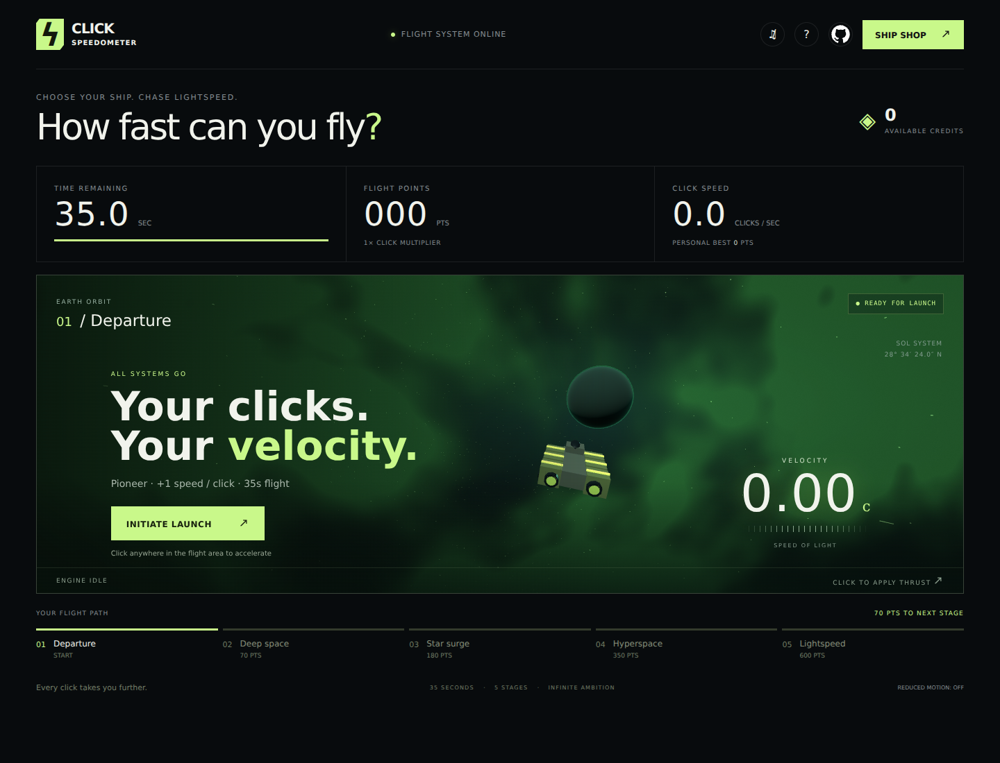

# Click Speedometer

**Choose your ship. Chase lightspeed.**

A space-themed click-speed game built with vanilla JavaScript and Three.js. Launch a timed flight, click to apply thrust, and turn your flight points into credits for a faster ship.

[](https://jesuspinar.com/click-speedometer/)

## How to play

1. Select **Initiate Launch** to start the countdown.
2. Click or tap the flight area to accelerate. You can also press **Space** during a flight.
3. Reach the next stage before time runs out: **Departure → Deep space → Star surge → Hyperspace → Lightspeed**. Stage thresholds are 0, 70, 180, 350, and 600 points.
4. Spend earned credits in the **Ship Shop** between flights. Every flight point becomes one credit when the run ends.

Your ship determines points per click and flight duration. The click-speed counter measures raw inputs over the last second, independently of ship upgrades. Velocity is an arcade simulation.


## Run locally

Use **Node.js 22.12+** and npm. The included Nix development shell provides Node.js 24; run `nix develop` if you use Nix with flakes enabled.

```bash
git clone https://github.com/jesuspinar/click-speedometer.git
cd click-speedometer
npm ci
npm run dev
```

Open the local URL printed by Vite.

## Development commands

| Command | Purpose |
| --- | --- |
| `npm run dev` | Start the Vite development server. |
| `npm test` | Run the game-logic tests with Node's built-in test runner. |
| `npm run build` | Build the production site into `dist/`. |
| `npm run preview` | Serve the production build locally after building. |

**Current test caveat:** `npm test` imports `dist/game.js`, but the Vite build bundles game logic into hashed assets and does not produce that file. As checked, the command fails with `ERR_MODULE_NOT_FOUND`; the test import needs to target `src/game.js` before the suite can run normally.

The production output is a static site. Deploy the contents of `dist/` to your preferred static host. Vite uses a relative asset base (`./`).

## Project structure

| File | Responsibility |
| --- | --- |
| `src/index.html` | Page structure, dashboard, shop, and dialogs. |
| `src/style.css` | Layout and visual styling. |
| `src/app.js` | UI events, audio, persistence, and animation loop. |
| `src/game.js` | Flight rules, ship definitions, stages, and save validation. |
| `src/scene.js` | Three.js space scene and flight animation. |
| `src/ships.js` | Spaceship models and shop previews. |
| `tests/game.test.js` | Game-logic tests. |
| `vite.config.js` | Development and production build configuration. |

## Saved progress

Progress is stored under `click-speedometer-v1` in browser `localStorage`. It is specific to the browser and site origin; clearing site data removes it. If storage is unavailable, progress lasts only for the current visit.
